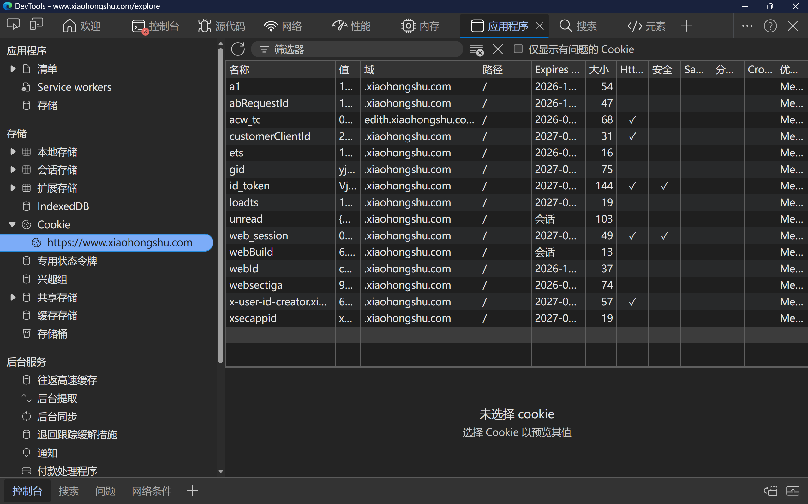

# 小红书 MCP Server

基于 [xiaohongshu-cli](https://github.com/jackwener/xiaohongshu-cli) 的 MCP Server，为 MCP 客户端提供小红书搜索、详情、评论和用户数据读取能力。

## 能力概览

- `search_notes`：搜索笔记
- `search_note_suggestions`：获取搜索联想词
- `get_note`：获取笔记详情
- `get_note_comments`：获取评论列表
- `get_comment_replies`：获取评论回复
- `get_user_info`：获取用户资料
- `get_user_notes`：获取用户发布的笔记
- `get_user_collections`：获取用户收藏的笔记
- `search_users`：搜索用户
- `search_topics`：搜索话题
- `set_cookies`：保存并验证登录 Cookie

## 环境要求

- Python `3.10+`
- [uv](https://github.com/astral-sh/uv)

## Quick Start

### 1. 克隆仓库

推荐克隆路径：`~/.local/share/opencode/mcp-servers`

```bash
cd ~/.local/share/opencode/mcp-servers
git clone https://github.com/luyanhexay/xiaohongshu-mcp.git
cd xiaohongshu
```

### 2. 安装 uv 并创建环境

如果尚未安装 uv，可以通过以下方式安装：

```bash
# macOS / Linux
curl -LsSf https://astral.sh/uv/install.sh | sh

# Windows (PowerShell)
powershell -ExecutionPolicy ByPass -c "irm https://astral.sh/uv/install.ps1 | iex"
```

然后创建环境并安装依赖：

```bash
uv sync --locked
```

### 3. 在 MCP 客户端里注册这个服务

以 OpenCode 为例，在 `~/.config/opencode/opencode.json` 的 `mcpServers` 中添加：

```json
{
  "xiaohongshu": {
    "type": "local",
    "command": [
      "/absolute/path/to/xiaohongshu/.venv/bin/python",
      "-m",
      "xiaohongshu_mcp.server"
    ],
    "environment": {
      "PYTHONPATH": "/absolute/path/to/xiaohongshu"
    },
    "enabled": true
  }
}
```

### 4. 准备 Cookie

先在浏览器中登录小红书，然后打开 DevTools 的 Cookie 面板：



复制`a1`、`web_session`和`webId`三个字段，然后直接对 AI 助手说：

```text
请调用 set_cookies 工具，并设置这段 Cookie：a1=...; web_session=...; webId=...
```

`set_cookies` 会把 Cookie 保存到本地的 `cookies.json`，然后立即做一次有效性验证。

当然，也可以直接把整个Cookie全选复制给Agent，让它自己解析。

另一种方式是把 Cookie 按照 `cookies.example.json` 的格式保存到一个 JSON 文件里，然后让 Agent 读取这个文件的内容并调用 `set_cookies`。内容格式如下：

```json
{
  "a1": "your-a1-cookie",
  "web_session": "your-web-session-cookie",
  "webId": "your-web-id-cookie"
}
```

### 5. 自检 / 健康检查

完成配置后，请直接向 AI 助手提问：

```text
请在小红书上搜索今日美食。
```

如果 MCP 服务已经被正确加载，AI 助手应当能够调用 `search_notes` 并返回结果。

## 工具说明

### `search_notes`

搜索小红书笔记。

- 必填参数：`keyword`
- 可选参数：`page`、`sort`、`note_type`
- 返回结果会保留每条笔记的 `xsec_token` / `xsec_source`，并自动写入 `xiaohongshu-cli` 的本地 token 缓存，供后续 `get_note` 复用。

### `search_note_suggestions`

获取某个关键词的搜索联想词。

- 必填参数：`keyword`
- 可选参数：`page`、`sort`、`note_type`

### `get_note`

获取某条笔记的精简详情。

- 必填参数：`note_id`
- 可选参数：`note_type`、`xsec_token`、`xsec_source`
- 默认会调用 `xiaohongshu-cli` 的 `get_note_detail()`，优先使用显式传入的 `xsec_token`，其次使用 `search_notes` 写入的 CLI token 缓存，最后由 CLI 自行尝试 HTML fallback。
- 如果刚从 `search_notes` 拿到结果，建议把对应的 `xsec_token` / `xsec_source` 一并传入；不传也会尽量复用 CLI 缓存。

### `get_note_comments`

获取笔记评论列表。

- 必填参数：`note_id`
- 可选参数：`cursor`、`xsec_token`

### `get_comment_replies`

获取某条评论的回复。

- 必填参数：`note_id`、`comment_id`
- 可选参数：`cursor`

### `get_user_info`

获取用户资料。

- 必填参数：`user_id`

### `get_user_notes`

获取用户发布的笔记。

- 必填参数：`user_id`
- 可选参数：`cursor`

### `get_user_collections`

获取用户收藏的笔记。

- 必填参数：`user_id`
- 可选参数：`cursor`

### `search_users`

搜索用户。

- 必填参数：`keyword`

### `search_topics`

搜索话题。

- 必填参数：`keyword`

### `set_cookies`

保存并验证 Cookie。

- 必填参数：`cookies`
- 支持 JSON 字符串
- 支持 Cookie 请求头字符串

## 一些已知问题和提示

- 有时候小红书会要求进行人类验证，导致检索失败。此时需要先在浏览器完成验证，再用 `set_cookies` 刷新 Cookie。
- 获取笔记详情时，优先通过 `search_notes` 获得该笔记的 `xsec_token`，再调用 `get_note`。MCP 会复用 `xiaohongshu-cli` 的 token 缓存，但不会自行绕过验证码或重写 CLI 的风控逻辑。

## 项目文件

```text
xiaohongshu/
├── .gitignore
├── cookies.example.json
├── docs/
│   └── assets/
│       └── cookie-tutorial.png
├── LICENSE
├── pyproject.toml
├── README.md
└── xiaohongshu_mcp/
    ├── __init__.py
    ├── client.py
    └── server.py
```

## 未来可能支持的功能

- [ ] 扫码登录
- [ ] 在触发人类验证时提供更清晰的浏览器验证与 Cookie 刷新提示

## 致谢

- [xiaohongshu-cli](https://github.com/jackwener/xiaohongshu-cli)
- [MCP](https://modelcontextprotocol.io/)

## 📄 License

MIT License
